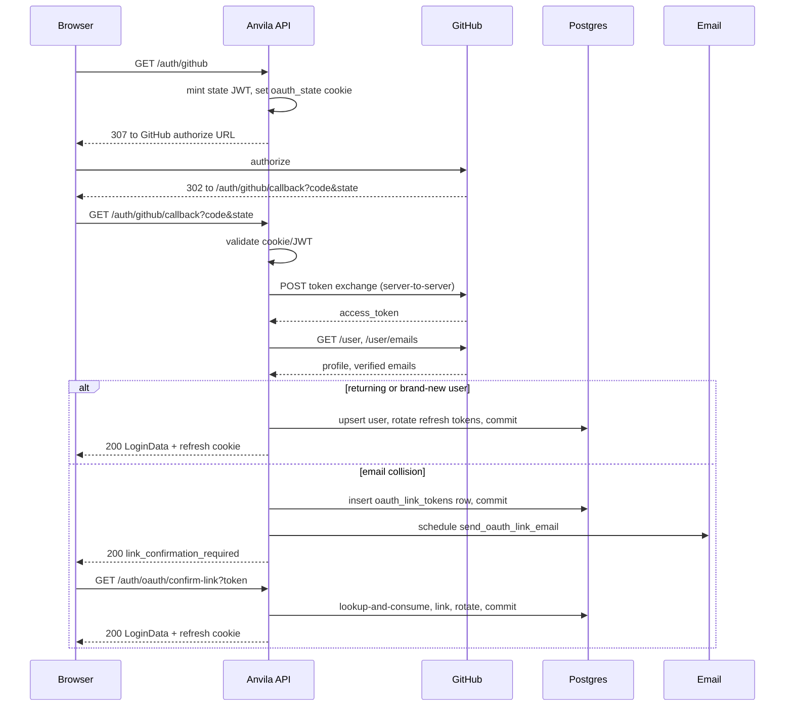

# GitHub OAuth — System Design

## Problem statement

Anvila needs GitHub as a second authentication provider alongside email+password and Google. The implementation must protect against state forgery, never leak provider secrets, require verified-email proof, and handle the case where GitHub returns an email that already belongs to a local account without silently merging identities.

## Architecture overview

Standard OAuth 2.0 authorization code grant with two outcomes at the callback: direct login (returning or brand-new user) and link-confirmation-required (collision with an existing local email). A short-lived hashed token mailed to the existing inbox provides cryptographic proof of email control before any link is applied.

## Data flow

**Login-completed path.** `process_github_callback` (`app/services/github_oauth.py:229`) exchanges the code, fetches profile and verified emails, resolves the primary verified email, then looks up the user by `github_subject` first and by `email` second. A subject match rotates refresh tokens and returns `LoginCompleted`. No match inserts a new `users` row with `provider=GITHUB` and mints tokens.

**Link-confirmation path.** When `github_subject` does not match but `email` does, `mint_link_token` (`app/services/oauth_link.py:20`) writes a hashed token to `oauth_link_tokens`. The route commits, schedules the outbound email via `BackgroundTasks`, and returns `LinkConfirmationRequired` with no session. The user clicks the email link; `consume_link_token` (`app/services/oauth_link.py:46`) validates with `SELECT ... FOR UPDATE`, marks it consumed, and the confirm-link route applies the link, rotates refresh tokens, and issues a session.

**Race rescue.** Two concurrent first-logins for the same GitHub user race on the `github_subject` unique index; the loser's `db.flush()` raises `IntegrityError`. The rescue re-queries by subject then by email and reuses the survivor for login or for link-token minting depending on whether it owns the subject.

## Key technical decisions

- **GitHub `id` as the stable provider key.** The numeric `id` is immutable; `login` can be renamed. `users.github_subject` (unique-indexed) holds `id`; `users.github_username` holds `login` separately.
- **Separate `oauth_link_tokens` table.** A dedicated table with a cascading FK on `user_id` keeps transient state off the canonical entity table and supports GDPR-style account deletion.
- **Interactive proof-of-control for same-email collisions.** Auto-linking on email match is the OWASP anti-pattern: a GitHub user claiming the email at GitHub would gain silent access to the local account. The mailed confirmation link enforces inbox control as a second factor.
- **Feature flag for staged rollout.** `GITHUB_OAUTH_ENABLED` gates conditional router inclusion; routes are absent from the OpenAPI schema until flipped on. Rollback is one env-var flip.
- **Refresh-token rotation on every OAuth login.** A compromised pre-existing session cannot survive a fresh OAuth login. Cost: one UPDATE.
- **Raw `HTTPException` errors.** GitHub OAuth routes return `{"detail": "..."}` for errors, matching FastAPI's default. A global envelope handler is deferred.
- **Structured logging with hashed emails.** Six event names cover the lifecycle; emails are reduced to a 16-character sha256 prefix for correlation. Tokens, codes, and provider bodies are never logged.

## Scaling considerations

Lookups use indexed columns: `users.email` (existing unique index), `users.github_subject` (new unique index), and `oauth_link_tokens.token_hash` (unique index). Each callback is O(log n) on `users` and `oauth_link_tokens`. HTTP calls to GitHub have a 10-second client timeout. Expired link tokens are scannable in O(log n) on `ix_oauth_link_tokens_expires_at` for a future cleanup job. The migration's `CREATE INDEX` is non-concurrent; acceptable at current table sizes and would be revised to `CONCURRENTLY` before deployment against large existing tables.

## Failure handling strategy

| Failure | Behavior |
|---------|----------|
| Provider outage (token, profile, or email endpoint) | `HTTPException(502, "...")` with safe message. No DB writes. Tests: `test_callback_token_exchange_4xx`, `test_callback_request_error_on_token_exchange`, `test_callback_request_error_on_emails`. |
| Invalid state | `HTTPException(400, "Invalid OAuth state")` before any provider call. Tests: `test_callback_state_mismatch`, `test_callback_state_token_expired`, `test_callback_state_token_wrong_purpose`. |
| Expired or consumed link token | `HTTPException(400, "Invalid or expired link token")` — identical shape to unknown-token to resist enumeration. Tests: `test_confirm_link_anti_enumeration[expired]`, `[consumed]`, `[unknown]`. |
| Concurrent first-login on same subject | `IntegrityError` rescue re-queries; survivor wins. Test: `test_callback_race_on_github_subject_logs_winner_in`. |
| Inactive user (either path) | `HTTPException(403, "Account is disabled")` immediately; no link email sent. Tests: `test_callback_inactive_existing_subject_returns_403`, `test_callback_inactive_existing_email_returns_403`, `test_confirm_link_inactive_user`. |
| Network timeout | Bounded by 10s `httpx.AsyncClient` timeout; surfaces as 502. |

## Tradeoffs

- **Same-email policy.** The link-confirmation flow trades a one-click delay for security; one extra round trip and one email.
- **Inline conditional feature flag.** Checked at module import inside `app/api/endpoints/auth.py:467` rather than in `app/api/router.py`. Co-locates the flag with the routes, at the cost of central-aggregator visibility.
- **Raw `HTTPException` errors.** Consistent with FastAPI defaults; inconsistent with the `ApiResponse` envelope used for success bodies. A global handler is deferred.

## Security considerations

State validation uses a JWT signed with the backend secret (`create_oauth_state_token` / `decode_token(expected_purpose="oauth_state")`) bound to the `oauth_state` HTTP-only cookie. Provider response bodies are never echoed in error responses. Tokens and codes never appear in URLs visible to the frontend or in any log line. The confirm-link endpoint enforces anti-enumeration: unknown, expired, and consumed tokens return identical 400 responses; the lookup uses a row-level lock to serialize concurrent confirms. Refresh tokens rotate on every OAuth login.

## Test strategy

31 active tests (plus 1 documented skip) across `tests/v1/auth/test_github_oauth.py` (23), `tests/v1/auth/test_oauth_link_confirm.py` (7), and `tests/v1/auth/test_oauth_smoke.py` (1). Coverage: start-route happy path; brand-new user with persistence proof via a second session; returning user with refresh-token rotation; both collision branches; the full state-validation matrix; the full provider-error matrix; code replay; `IntegrityError` race rescue on subject and email; inactive users on both paths; anti-enumeration parametrized over unknown/consumed/expired tokens; a Google smoke regression. Outbound HTTP is stubbed at the service module via monkey-patch.

## Observability

Six structured log events emitted at `_logger.info` (success/lifecycle) and `_logger.warning` (errors):

- `auth.oauth.github.callback.start` — pending; no PII.
- `auth.oauth.github.callback.success` — fields: `outcome=returning_user|new_user|race_resolved`, `user_id`, `email_hash`.
- `auth.oauth.github.callback.error` — fields: `outcome=no_access_token|no_profile_id|no_verified_email`.
- `auth.oauth.github.link_pending` — fields: `outcome=link_required|link_required_race`, `user_id`, `email_hash`.
- `auth.oauth.github.link_confirmed` — fields: `outcome=success`, `user_id`, `email_hash`.
- `auth.oauth.github.link_failed` — fields: `outcome=error`, `error_class`.

Emails are hashed to a 16-character sha256 prefix. Raw emails, tokens, codes, client secrets, and provider response bodies never appear in any log statement.
